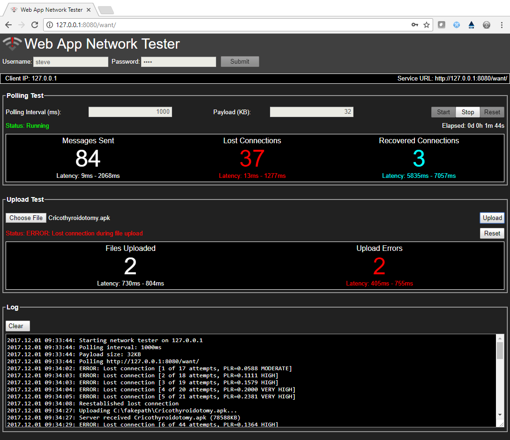

 

The Web App Network Tester (WANT) is a web application that tests for network issues including latency and packet loss issues between client browsers and back-end web service engines (e.g., Apache Tomcat). This code is distinguished from other web browser network analysis tools by continuously polling the back-end using user-defined intervals and payload sizes. In addition, this tester includes a file-upload feature for testing of large file uploads. This web application has been used to detect network issues caused by browser cache, network proxy, and network load issues.

## Deployment Installation

Copy ```/deploy/nettester``` to the host and set environment variable
```$NETTESTER_HOME``` to point to directory ```/nettester```.  

Next, download the latest release of ```want.war``` to the ```$CATALINA_HOME/webapps``` directory used for your existing web applications then restart Tomcat.

To run, point your browser to ```http(s)://[host]/want```. 

## Screenshot




License
----
DHS open source

